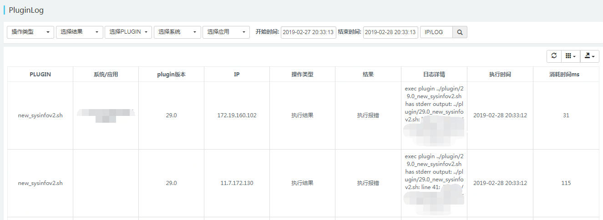

# Plugin管理
对插件进行创建、删除等管理

### 可操作类型：
- 插件上传：将自定义插件上传到服务端，插件可以是任意的可执行脚本，例如shell、python等
- 插件删除：删除不必要的插件
- 插件绑定：建立服务器与插件的对应关系，一个服务器上运行的agent可以执行多个插件。点击绑定按钮，打开新窗口进行绑定操作

- 全网绑定：绑定所有服务器
- 服务器批量绑定：绑定勾选的服务器
- 输入列表服务器批量绑定：绑定输入的服务器
###插件状态管理：
对服务器上某个插件进行部署、启动和停止等操作

操作对象分为三类：
- 批量：选定下列服务器进行操作
- 列表：手工数据服务器IP进行操作
- 全部：针对所有服务器进行操作
###Plugin日志：
展示插件各种操作类型的执行结果

操作类型分为五类：
- 插件启动
- 插件停止
- 插件下载
- 插件删除
- 插件运行结果：展示所有运行失败的结果